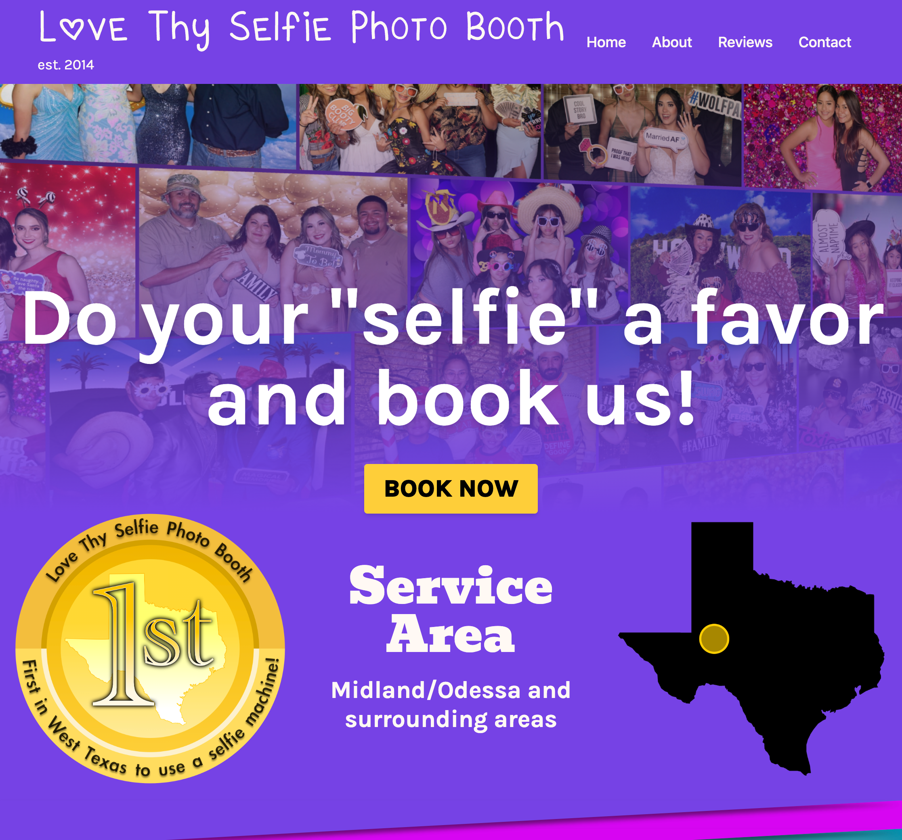
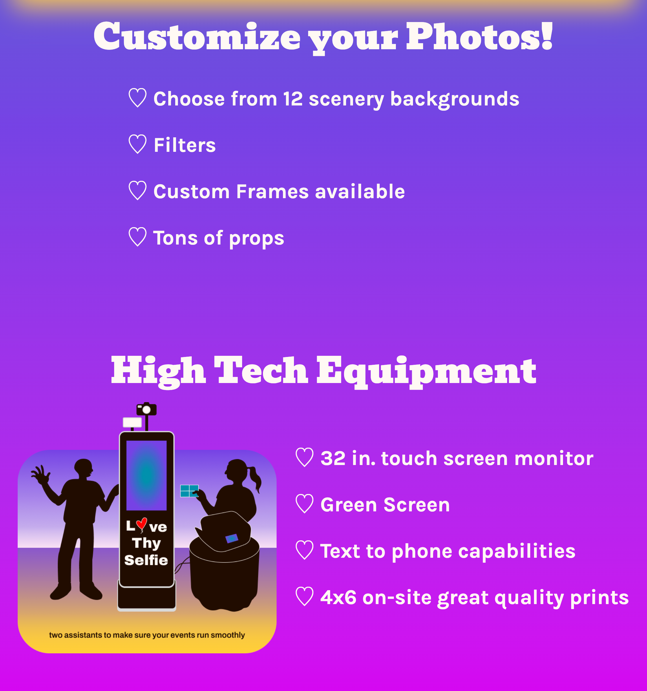
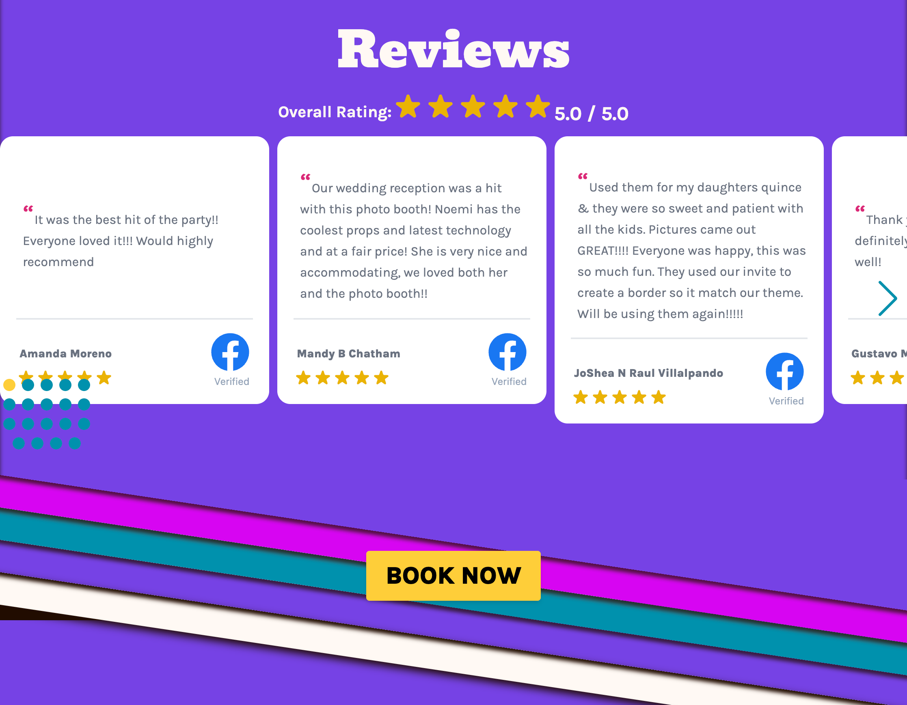
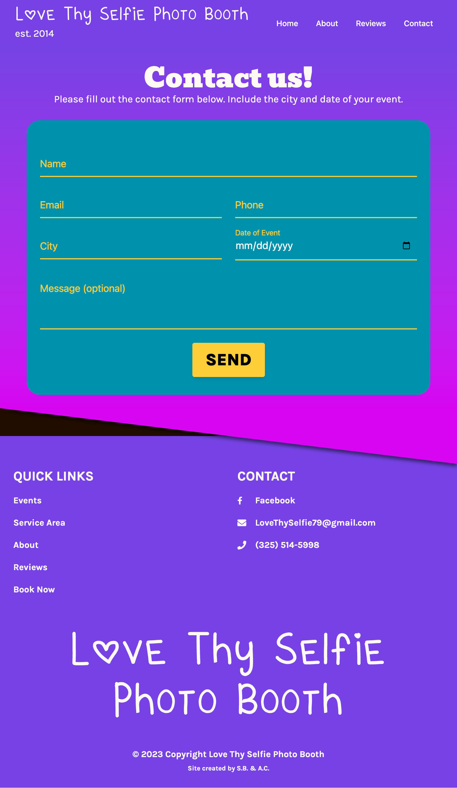
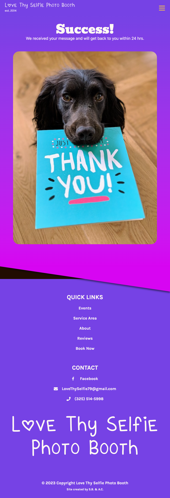

# Love Thy Selfie

## Deployments
[Production](https://www.lovethyselfiephotobooth.com/)

[Staging](https://love-thy-selfie.vercel.app/)

## Description
Love Thy Selfie is an intuitive, mobile-first React application designed to digitally transform a local photo booth business. Embodying the spirit of 'Love Thy Selfie', this platform offers users a comprehensive overview of the diverse services provided, including vivid picture examples, and authentic customer reviews. It also showcases the geographic service areas to help customers understand their reach. One of the key features is a seamlessly integrated contact form powered by Email.js, enabling customers to easily inquire about booking opportunities. With its user-friendly interface and responsive design, the Love Thy Selfie website effectively brings the unique essence of the photo booth experience online, and at the fingertips of potential customers.

## Table of Contents
- [Features](#features)
- [Resources](#resources)
- [Contributing](#contributing)
- [Questions](#questions)

## Features
The landing page of the website features a visually appealing hero collage, which is a combination of images that represent the essence of the business. The landing page also prominently displays a booking button, allowing users to easily access the booking functionality. Additionally, relevant information about the service area is provided, giving users a clear understanding of where the service is available.

The website includes a slideshow that automatically displays a series of random photos. These photos are carefully selected to highlight the high-quality nature of the photos offered by the service. The slideshow adds a visually engaging element to the website, capturing the attention of users and leaving a positive impression.

This section of the website highlights the various features and benefits that customers can enjoy when booking Love Thy Selfie for their next event. By showcasing the features, the website aims to persuade and attract potential customers by demonstrating the value they can gain from choosing Love Thy Selfie.

The website incorporates a carousel, which is a dynamic element that displays a series of customer reviews. These reviews are from real customers who have previously used the service and are intended to build trust and credibility. The carousel design adds an aesthetic touch to the website, allowing users to easily scroll through the reviews and gain insights into the positive experiences of others.

The website provides a convenient and user-friendly booking process. Customers can book their next event by filling out a contact form, which includes fields for entering relevant information such as name, email, event details, and preferred dates. This feature enables users to easily express their interest in booking the service and initiate the reservation process.

After submitting the contact form, users receive a confirmation message indicating the successful completion of the form submission. This message serves as a reassurance to users, letting them know that their request has been received and will be processed accordingly. The successful message helps create a positive user experience by providing feedback and a sense of accomplishment after completing the booking process.

## Resources:
- [Vite](https://vitejs.dev/) 
- [Tailwind](https://tailwindcss.com/) 
- [Cypress](Cypress)
- [Emailjs](https://www.emailjs.com/) 

## Contributing
<table>
  <tr>
<td align="center"><a href="https://github.com/andcooke"> <b>Andrew Cooke</b></a></td>
<td align="center"><a href="https://github.com/missatrox44"> <b>Sara Baqla</b></a></td>

 </tr>
</table>

## Questions
Feel free to contact any contributing developer with suggestions for improvements, questions or concerns.
 
[Email: Andrew Cooke](mailto:andcooke@duck.com) 
[Email: Sara Baqla](mailto:missatrox44@gmail.com)  

Copyright (c) 2023 Love Thy Selfie